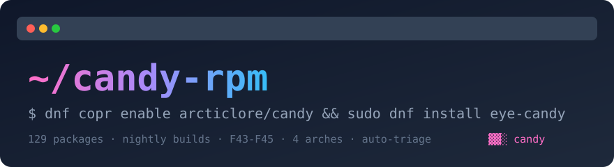

<div align="center">

[Русский](README.md) | [English](README.en.md)




[](LICENSE)

# 🧊 candy-opensuse

**Unofficial stable COPR repository of terminal eye-candy for openSUSE**
(a port of [candy-rpm](https://github.com/arcticlore/candy-rpm))

**127 packages** · auto-updated daily · **x86_64 + aarch64**
*opensuse-tumbleweed · opensuse-leap-16.0*

</div>

---

## 📦 Quick setup (openSUSE)

```bash
sudo zypper addrepo --refresh \
  "https://copr.fedorainfracloud.org/coprs/arcticlore/candy-opensuse/repo/opensuse-tumbleweed-$basearch/arcticlore-candy-opensuse.repo" \
  arcticlore-candy-opensuse
sudo zypper --gpg-auto-import-keys refresh
sudo zypper install linuxwave
```

For **Leap 16.0** replace `tumbleweed` with `leap-16.0` in the URL.

> ⚠️ Unofficial third-party repository. Rare breakage on brand-new upstream
> releases is possible; the package keeps its last working version and an issue
> is filed. `dnf info <pkg>` / `zypper info <pkg>` lists the upstream official
> install method.

### Migrating from the retired beta

The old `arcticlore/candy-opensuse-beta` channel is **retired and read-only**.
All 127 verified beta packages have moved to stable:

```bash
sudo zypper removerepo arcticlore-candy-opensuse-beta
sudo zypper addrepo --refresh \
  "https://copr.fedorainfracloud.org/coprs/arcticlore/candy-opensuse/repo/opensuse-tumbleweed-$basearch/arcticlore-candy-opensuse.repo" \
  arcticlore-candy-opensuse
sudo zypper --gpg-auto-import-keys refresh
```

## 🔗 Links

| | |
|---|---|
| 🐙 **GitHub** | [arcticlore/candy-opensuse-beta](https://github.com/arcticlore/candy-opensuse-beta) |
| 📦 **COPR (stable)** | [arcticlore/candy-opensuse](https://copr.fedorainfracloud.org/coprs/arcticlore/candy-opensuse/) |
| 🧪 **COPR (pilot)** | [arcticlore/candy-opensuse-pilot](https://copr.fedorainfracloud.org/coprs/arcticlore/candy-opensuse-pilot/) |
| 🧊 **COPR (retired beta)** | [arcticlore/candy-opensuse-beta](https://copr.fedorainfracloud.org/coprs/arcticlore/candy-opensuse-beta/) |
| 🐙 **Upstream catalog** | [arcticlore/candy-rpm](https://github.com/arcticlore/candy-rpm) |

## ✨ Highlights

<details open>
<summary>🖼️ Fetch — system info with ASCII art</summary>

| Package | What it does |
|---------|-------------|
| `neofetch` | the classic: distro logo + specs |
| `macchina` | a minimal Rust fetch |
| `onefetch` | git-repo info with ASCII stats |
| `ghfetch` | your GitHub profile right in the terminal |
| `archey4` | pywal-aware fetch |

</details>

<details open>
<summary>🎨 Screensavers & ASCII art</summary>

| Package | What it does |
|---------|-------------|
| `pipes.rs` / `pipes.sh` | rainbow pipes — Rust, even smoother |
| `terminal-parrot` / `parrotsay` | a parrot / a parrot on your commands |
| `hollywood` | the "hacker door" — fake furious progress |
| `unimatrix` | digital rain in Matrix style |
| `lavat` | lava lamp in your terminal |
| `tty-clock` | huge digital clock |
| `ascii-image-converter` | images as ASCII art |

</details>

<details open>
<summary>🛠️ Eye-candy while working: CLI upgrades</summary>

| Package | What it does |
|---------|-------------|
| `sd` | sed with a sane syntax |
| `xh` / `curlie` | curl, but like httpie |
| `viddy` | `watch` in real time |
| `doggo` | dig with a human face |
| `broot` | file manager + tree + search |
| `tealdeer` | tldr: short man pages |
| `bottom` | system monitor with graphs |
| `trippy` | traceroute++ |

</details>

<details open>
<summary>🎮 Games & arcades</summary>

| Package | What it does |
|---------|-------------|
| `pokemon-icat` | pokemon sprites as terminal icons |
| `tty-solitaire` | Klondike solitaire on ncurses |
| `ttyper` / `toipe` | touch-typing trainers |

</details>

<details open>
<summary>🖥️ Terminal replacements</summary>

| Package | What it does |
|---------|-------------|
| `Rio` | next-gen Rust terminal |

</details>

## 🔎 Searching packages

```bash
sudo zypper search --repo arcticlore-candy-opensuse fetch
sudo zypper packages --repo arcticlore-candy-opensuse
```

## ⚙️ How it works

```
pkgs.json             single source of truth: packages + openSUSE chroots
bin/gen_specs.py      renders .spec files (Fedora → openSUSE deps translation)
bin/coprase-status.py refreshes upstream versions → state/state.json
bin/make-srpm.sh      sources + vendor tarballs (cargo/go/node) + rpmbuild -bs
bin/copr_waiter.py    waits for a build and enforces the exact 4/4 gate
bin/auto-publish.py   wave pipeline: pilot (4/4) → same SRPM → stable (4/4)
```

## 🏗️ Two-tier publishing (pilot → stable)

Every package is first built in the **pilot** project. Only when the build is
green exacly **4/4 chroot succeeded** (no skip / cancel / fail / missing chroot
/ API error / timeout), the *same* SRPM is submitted to **stable**. The previous
stable version stays untouched if the pilot is not clean.

`update.yml` runs daily for **new upstream versions only** (no artificial
rebuilds), keeps waves small (`max_wave`), never duplicates active builds
(resume by existing build id), and files an issue on non-clean outcomes. State
and regenerated SPECs are committed via a reviewable bot PR that gets merged
only on an exact regenerated diff with green required checks.

## 🤝 Contact

- 🐛 Bugs / package requests — [Issues](https://github.com/arcticlore/candy-opensuse-beta/issues)
- 💬 More candy for Fedora — [candy-rpm](https://github.com/arcticlore/candy-rpm)

## 📄 License

MIT — [LICENSE](LICENSE)

<br><br>

> The code is provided "as is." Even the author no longer remembers how it works. Good luck!